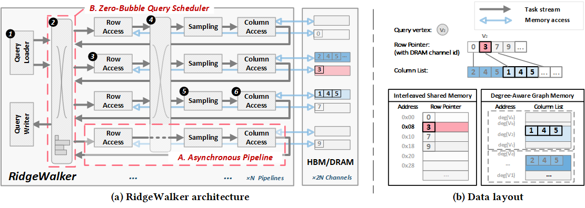
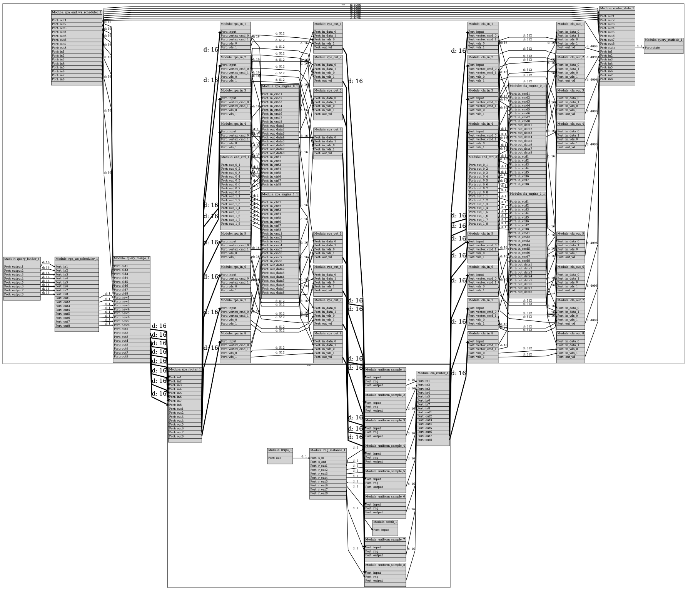

[](./LICENSE)
[](https://github.com/Xtra-Computing/RidgeWalker/issues)


# RidgeWalker: Perfectly Pipelined Graph Random Walks on FPGAs

## Table of Contents

<!-- MarkdownTOC -->

- [Introduction](#introduction)
- [Demo of RidgeWalker for URW](#demo-of-ridgewalker-for-urw)
    - [Async access engine and scheduler modules (one-line role)](#async-access-engine-and-scheduler-modules-one-line-role)
    - [Uniform random walk app (`app/uniform_random_walk`)](#uniform-random-walk-app-appuniform_random_walk)
    - [Architecture-to-code map](#architecture-to-code-map)
    - [Build](#build)
    - [Run](#run)
- [Getting Started](#getting-started)
    - [System Requirements and Dependencies](#system-requirements-and-dependencies)
    - [Setting Up the Compilation Environment](#setting-up-the-compilation-environment)
        - [Installing RABS Dependency](#installing-rabs-dependency)
    - [Compiling RidgeWalker](#compiling-ridgewalker)
        - [Cloning the Repository with Submodules](#cloning-the-repository-with-submodules)
        - [Understanding the Code Structure](#understanding-the-code-structure)
        - [Building RidgeWalker](#building-ridgewalker)
    - [Running RidgeWalker](#running-ridgewalker)
        - [Program Overview](#program-overview)
        - [Preparing Datasets](#preparing-datasets)
        - [Downloading Formatted Datasets](#downloading-formatted-datasets)
        - [Executing the Program](#executing-the-program)
- [Acknowledging Our Work](#acknowledging-our-work)

<!-- /MarkdownTOC -->


## Introduction

This repository contains the source code for RidgeWalker, an FPGA accelerator for graph random walks (GRWs). GRWs are core to graph analytics and ML pipelines but are bottlenecked by irregular, random memory access and variable walk lengths, which cause low bandwidth utilization and pipeline bubbles on conventional architectures. RidgeWalker makes the repo self-contained by capturing the paper’s key ideas here: it decomposes each walk into stateless tasks (leveraging the Markov property), executes them asynchronously across multiple pipelines to hide memory latency, and uses a zero-bubble scheduler plus routing fabric to dynamically balance workload and keep pipelines fully utilized under imbalance.



## Demo of RidgeWalker for URW

RidgeWalker is a high-performance GRW FPGA accelerator. The URW implementation lives under `app/urw` and follows the same build flow as other applications in this repo.

### Async access engine and scheduler modules (one-line role)

- `src/rng_data_type/Makefile`: RNG data types shared across sampling and pipeline stages.
- `src/rw_data_type/Makefile`: random-walk metadata types shared across URW/LV stages.
- `src/switch_data_type/Makefile`: switch-network framing and routing data types.
- `src/switch_butterfly/Makefile`: butterfly routing fabric for task/packet balancing.
- `test/end_ctrl_16/Makefile`: 16-lane end-control/termination helper for LV pipelines.
- `src/irsgu/Makefile`: sampling unit that generates candidate transitions.
- `src/lv_sou/Makefile`: long-vertex stream source utilities for LV pipeline injection.
- `src/lv_rpa_router/Makefile`: RPA task router between pipeline stages.
- `src/lv_rpa_access/Makefile`: row-pointer access stage for LV pipeline.
- `src/lv_sample/Makefile`: LV sampling stage that selects next-hop indices.
- `src/lv_cla_router/Makefile`: CLA task router between pipeline stages.
- `src/lv_cla_access/Makefile`: column-list access stage for LV pipeline.
- `test/lv_host_urw/Makefile`: host harness for LV/URW pipeline testing.
- `src/lv_rpa_ws_scheduler/Makefile`: zero-bubble scheduler for work-stealing and load balance.
- `test/lv_test_rpa_loader/Makefile`: RPA loader test/validation module.

### Uniform random walk app (`app/uniform_random_walk`)

This app is an example pipeline configuration for a uniform random walk build.




Module map (from `app/uniform_random_walk/kernel.mk`):

- `lib/common_host.mk`: common host build flags and utilities.
- `host/pcg/Makefile`: host-side RNG seed/setup.
- `host/xcl2/Makefile`: XRT helper wrappers for device/queue setup.
- `host/helper/Makefile`: CLI and helper utilities.
- `host/log/Makefile`: host logging utilities.
- `host/xgraph/Makefile`: graph loader and CSR utilities.
- `src/rng_data_type/Makefile`: RNG data types shared by kernels.
- `src/rw_data_type/Makefile`: random-walk data types shared by kernels.
- `src/switch_data_type/Makefile`: switch network data types and framing.
- `src/switch_butterfly/Makefile`: butterfly switch fabric for routing tasks/frames.
- `test/end_ctrl_16/Makefile`: end-control/termination for 16-lane paths.
- `src/irsgu/Makefile`: sampling unit feeding traversal.
- `src/lv_sou/Makefile`: long-vertex stream source utilities.
- `src/lv_rpa_router/Makefile`: router for RPA task streams.
- `src/lv_rpa_access/Makefile`: RPA access stage for vertex reads.
- `src/lv_sample/Makefile`: sampling stage for next-hop selection.
- `src/lv_cla_router/Makefile`: router for CLA task streams.
- `src/lv_cla_access/Makefile`: CLA access stage for vertex reads.
- `src/lv_rpa_ws_scheduler/Makefile`: work-stealing scheduler for pipeline balance.
- `test/lv_host_urw/Makefile`: host test harness for LV/URW pipeline.
- `test/lv_test_rpa_loader/Makefile`: RPA loader test module.

### Architecture-to-code map

- **Asynchronous pipeline (RPA / Sampling / CLA)**:
  - RPA (Row Pointer Access): `src/lv_rpa_access/` implements row-pointer access in the LV pipeline.
  - Sampling: `src/urw/cal_sample_index.cpp` (URW) and `src/lv_sample/` (LV pipeline) select next-hop indices.
  - CLA (Column List Access): `src/lv_cla_access/` implements column-list access in the LV pipeline.
- **Asynchronous memory-access engine**: `src/mem/mem_access.cpp` implements the burst-read engine, while `src/step_loader/` (query injection) and `src/ring_manager/` (active query slots) maintain outstanding work for non-blocking access.
- **Task Router / Interconnect**: `src/switch_butterfly/` implements the butterfly routing fabric used to steer tasks between pipelines and memory channels.
- **Zero-Bubble Scheduler**: `src/lv_rpa_ws_scheduler/` and `src/lv_rpa_ws_scheduler_2x2/` implement the work-stealing schedulers described in the zero-bubble design.
- **Query Loader (host)**: `host/urw/` and `host/kernel/load_graph.h` load queries and graph data for uniform_random_walk runs.

### Build

Example build (uniform_random_walk target):

```bash
make app=uniform_random_walk all -j
```

### Run

Example run (URW host app + bitstream + graph):

```bash
./uniform_random_walk.app -fpga build_dir_urw/kernel.xclbin -graph /path/to/formatted/graph
```

URW host CLI options (from `host/kernel/load_graph.h`):

- `-graph`: path to a CSR-formatted graph (defaults to `/data/graph_at_scale/youtube`)
- `-fpga`: path to the `.xclbin` bitstream (defaults to `build_dir_${app_name}/kernel.xclbin`)
- `-qsize`: override query size (minimum 512)
- `-vl` `-el` `-vw` `-ew` `-ep` `-al` `-rj`: graph feature flags (labels/weights/prefix-sum/alias/rejection)

**Under Construction**


## Getting Started


### System Requirements and Dependencies

To ensure the smooth operation of our code, we have outlined the necessary system requirements and dependencies below. Please ensure your environment aligns with the following specifications:


|Dependency| Description|
|--------------|--------------|
|OS| Ubuntu 20.04|
| Linux Kernel: | 5.4.x |
| FPGA Platform:| AMD Alveo U55C|
| FPGA Development: | Vitis Core Development Kit 2021.2 |
| FPGA Shell:| xilinx_u55c_gen3x16_xdma_base_3 (modified)|
| FPGA runtime:| XRT 2.18.179 |

**NOTE*: Please note that the FPGA Shell has been modified to suit the specific needs of our project. Ensure you have the correct version with the following instructions.


### Setting Up the Compilation Environment

The official U55C shell limits the number of FPGA kernels that can be implemented. To accommodate our design, we have modified the official U55C shell. The following instructions will guide you through setting up a development environment that can reproduce our implementations.

We recommend using the [HACC@NUS cluster](https://xacchead.d2.comp.nus.edu.sg), as it already has all the required environment set up.


#### Installing RABS Dependency

RidgeWalker uses the Rule-Based Accelerator Building System (RABS) on top of Vitis to build accelerators. To install the required packages:

```bash
sudo apt install graphviz libgraphviz-dev faketime opencl-headers
pip install numpy
pip install graphviz
pip install networkx
pip install networkit
```


### Compiling RidgeWalker

#### Cloning the Repository with Submodules

To clone the repository along with its submodules, use the following command:

```bash
git clone --recurse-submodules  git@github.com:Xtra-Computing/RidgeWalker.git
```

#### Understanding the Code Structure

The repository is structured as follows:

``` shell
├── app        # Contains the configurations for the accelerator project. Each subfolder corresponds to a hardware accelerator.
│   ├── test   # Contains the configurations for unit tests or benchmark projects.
├── host       # Contains the CPU code for preparing data and controlling the FPGA accelerator.
├── src        # Contains the FPGA source code, grouped in modules.
├── test       # Contains the CPU/FPGA test code.
├── lib        # Contains libraries of rules to use as a subgroup of kernels.
├── misc       # Contains scripts for automating tests.
└── mk         # Contains the RABS submodule for building the accelerator.
```

#### Building RidgeWalker

To build RidgeWalker, use the `make` command as shown below. Replace `${app_name}` with the name of the application in the `app` directory:

```bash
make app=${app_name} TARGET=hw all
```

Here's a quick guide to the arguments:

- `app`: Specifies the target accelerator to be built.
- `TARGET`:
    + `hw`: Builds an accelerator that can run on real FPGA hardware.
    + `hw_emu`: Builds a project that can run waveform-based simulation.
    + The default value can be found in the corresponding `kernel.mk` files.
- `all`: Builds the entire project.

For example, to build a full implementation of the MetaPath random walk accelerator, use:

```bash
make app=metadata TARGET=hw all
```

To build a full implementation of the Node2Vec random walk accelerator, use:

```bash
make app=node2vec TARGET=hw all
```

Please note that the build of each accelerator may take around 15 hours, depending on the server's performance.

To build tests and benchmarks (projects in `app/test/`), replace `app=${app_name}` with `test=${test_name}`, where `${test_name}` the name of the test project. For example:

```bash
make test=vcache_test TARGET=hw all
```
The above make command generate the accelerator of vcache_test unit test of DAC cache.


### Running RidgeWalker

#### Program Overview

A successful build will generate the program and FPGA bitstream. Here is an example of the `metapath` build:

```base
├── metapath.app                      # CPU program.
├── build_dir_metapath_metapath
│   ├── clock.log                        # Accelerator clock.
│   ├── git
│   ├── kernel.cfg.json.pdf              # Accelerator kernel topology.
│   ├── kernel.link.ltx
│   ├── kernel.link.xclbin.info
│   ├── kernel.link.xclbin.link_summary
│   ├── kernel.xclbin                    # FPGA bitstream.
│   ├── kernel.xclbin.package_summary
│   ├── link                             # FPGA build log.
│   ├── report                           # FPGA report.
└── xrt.ini
```


#### Preparing Datasets

RidgeWalker accepts graphs in the same format as ThunderRW. You can follow the `prepare_data.sh` script [here](https://github.com/Xtra-Computing/ThunderRW/blob/main/prepare_data.sh) to prepare the input graphs, or you can download them in the next section.

#### Downloading Formatted Datasets

You can download the formatted graphs [here](https://www.dropbox.com/scl/fo/1jk8fllupfxvpvdbsdfip/h?rlkey=rxffrugutahykjomiu1vq5qyr&dl=0). These can be used directly as the input for our accelerator.


Here, `${PCIE_ID}` is the PCIE BDF id of the FPGA board.

#### Executing the Program

To execute the program, use the following command, for example the `${metapath_x4}`

```bash
./metapath_x4.app  -fpga build_dir_metapath_metapath_x4/kernel.xclbin -graph ${path/to/formatted/graph}
```

The arguments are as follows:

- `fpga`: The `kernel.xclbin` file used to configure the FPGAs.
- `graph`: The path that stores the graph dataset.


## Acknowledging Our Work

We kindly request that you acknowledge our work by citing our research paper if you found our repository beneficial for your research. Below is the citation in BibTeX format for your convenience:

```bibtex
@inproceedings{tan2026ridgewalker,
  author    = {Hongshi Tan and Yao Chen and Xinyu Chen and Qizhen Zhang and Cheng Chen and Weng-Fai Wong and Bingsheng He},
  title     = {RidgeWalker: Perfectly Pipelined Graph Random Walks on FPGAs},
  booktitle = {Proceedings of the IEEE International Symposium on High Performance Computer Architecture (HPCA)},
  year      = {2026},
  organization = {IEEE},
  note      = {20\,min talk, Main Conference, FPGA, SmartNIC, and Reconfigurable Computing Track},
  url       = {https://2026.hpca-conf.org/details/hpca-2026-main-conference/26/RidgeWalker-Perfectly-Pipelined-Graph-Random-Walks-on-FPGAs}
}
```
